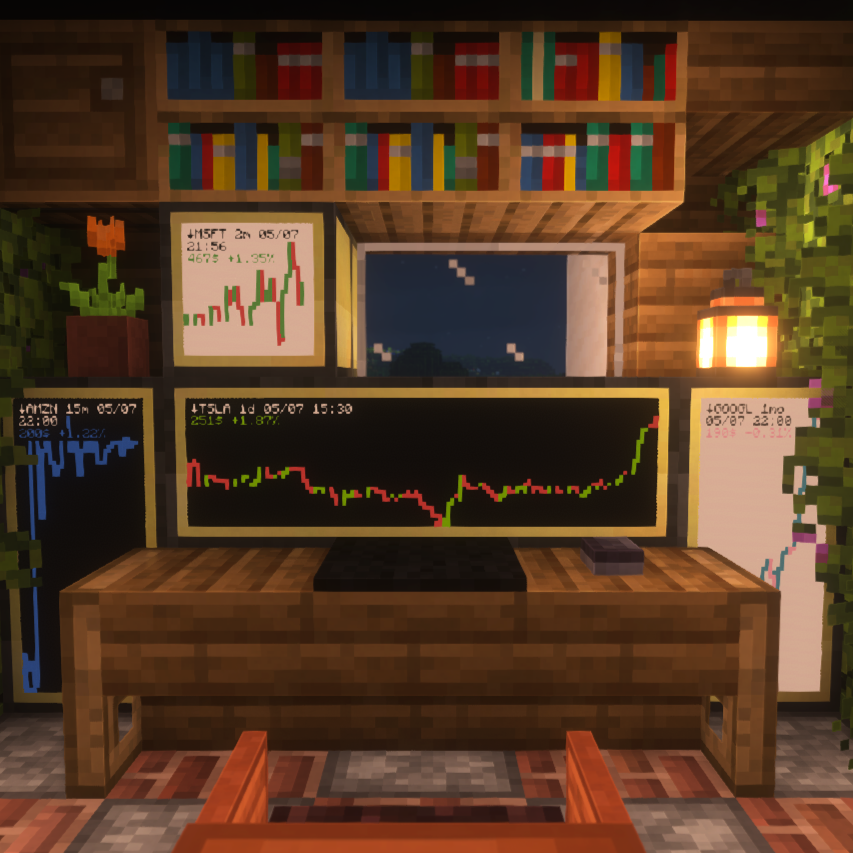
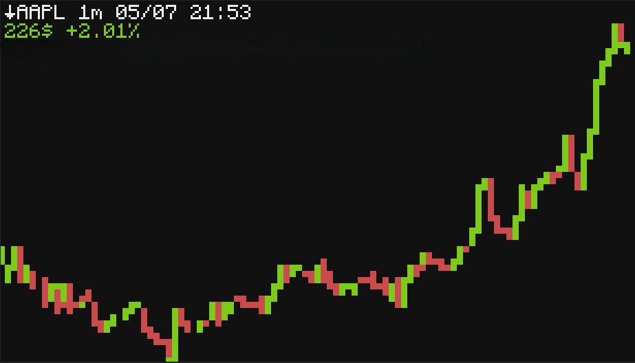

# CC:StockDisplay 📈
**Bring real-world stock values into your Minecraft world.**
By leveraging the Yahoo Finance API, this app fetches and displays current stock data, allowing you to monitor your not so virtual wealth.

<table style="border: none;">
  <tr>
    <td style="border: none; height: 400px;">
      
    </td>
    <td style="border: none; height: 400px;">
      
    </td>
  </tr>
</table>

## Installation 📥
The app can be installed by running the following command:

First download the file from github and save it by running this:
```shell
wget https://raw.githubusercontent.com/0ctoqus/CC-StockDisplay/main/StockDisplay.lua
```
Then run the downloaded app:
```shell
./StockDisplay.lua
```

You can also get the app from the [PineStore](https://pinestore.cc/projects/103/stock-display).


## Customization ⚙️
You can set the different stocks to display as well as the colors at the start of the StockDisplay.lua file.


#### Stocks Settings 🌎
Stocks data is downloaded using the Yahoo Finance API. To find the stocks you want to display, locate their corresponding **symbol** and **region** by searching on https://finance.yahoo.com/lookup.

For instance, if you want to display AMD, you can search for it and find the symbol in the URL of the selected quote: https://finance.yahoo.com/quote/AMD/. The symbol is **AMD**.

Determining the region for the stock can be done by checking the exchange it is traded on. For AMD, the *NASDAQ Global Select Market* is a stock exchange located in the United States. Therefore, the region for **AMD** is the United States, which in the code would be **US**.

Once you've found the symbol and the region, you can use them in the following ways:

- **Option 1:** Change the script's default selection
  Add them to the code by modifying the stocks array at the beginning of the lua file. The first element represents the **ticker**, while the second represents the **region**. This will change the default selection you get when running the program.

  ```lua
  local stocks = {{"AAPL","US"}, {"GOOGL","US"}, {"AMZN","US"}, {"META","US"}, {"MSFT","US"}}
  ```

- **Option 2:** Edit the config file
  After stopping the program by pressing CTRL+T, you can edit the `select_stock_config.json` file and change these values.


#### Color settings 🎨

You can customize the color of the chart by modifying the values at the beginning of the Lua file. The available color options include white, orange, magenta, lightBlue, yellow, lime, pink, gray, lightGray, cyan, purple, blue, brown, green, red, and black.
Here's how the default color settings are defined:

```lua
local defaultTextColor = colors.white
local buyColor = colors.lime
local sellColor = colors.red
local backgroundColor = colors.black
```

To change the color, simply replace the color name after the equals sign with your desired color. For example, to change the background color to blue, you would modify the `backgroundColor` line to:

```lua
local backgroundColor = colors.blue
```

## How it does it work ❓
1. Automatically download the display lib [Pixelbox_lite](https://github.com/9551-Dev/pixelbox_lite) from Github (Thanks to 9551), allowing us to have an improved resolution for display.
2. Registers the script to startup, so it will start automatically with the computer (and so also on world load).
3. Checks if you already have a stock selected to display. If not, it will prompt you to select one stock with an interval and range. It will then save it to a config file for later use. If you want to change the selection, you can do it by changing the local stocks array and deleting the config file by running ``` rm selected\_stock\_config.json ```.
4. Fetches the current GMT real world time from the internet to later calculate market open and close.
5. Sets the display to an external monitor if possible.
6. Downloads and loads the stock data (in this step, we also remove empty values by discarding them).
7. Displays the graph and stock information based on the collected values.

### Limitations 🚧
* Currently, the script can only display one stock per computer.
* No axes are currently displayed.
* Each candles represent the current non-null close value versus the previous non-null close value to avoid missing data points. So no 100% real world timeframe handling or accurate display.
* Pixels may be missing on the graph due to the current way of displaying them using overlapping smaller characters.