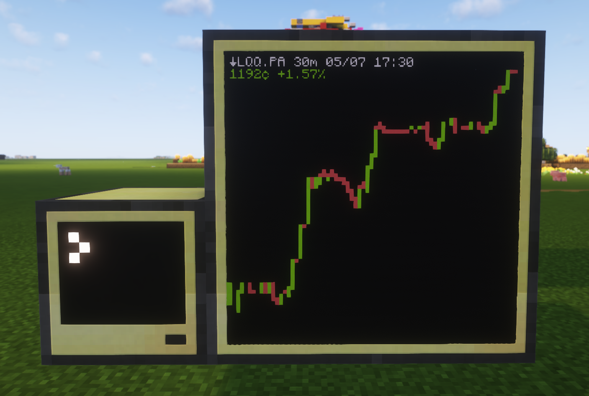

# CC:StockDisplay
Display real world stock values on a Computecraft inside Minecraft.
It currently fetches data from the Yahoo Finance API and displays it.


## Installation
The client can be installed by running the following command:
```shell
wget run ...
```

## Customization
You can set the different stocks options to display as well as the colors at the start of the StockDisplay.lua file.

#### Stocks settings
```lua
-- Define a table of stock symbols and regions
-- You can look in the URL of quotes selected from https://finance.yahoo.com/lookup to add them here
local stocks = {{"NQ=F", "US"}, {"LQQ.PA", "EU"}}
```

#### Color settings
```lua
-- Set the colors of display
-- You can select from white, orange, magenta, lightBlue, yellow, lime, pink, gray,
-- lightGray, cyan, purple, blue, brown, green, red, black
local defaultTextColor = colors.white
local buyColor = colors.lime
local sellColor = colors.red
local backgroundColor = colors.black
```

## How it works
1. Automatically download the display lib from Github, allowing us to have an improved resolution for display, but comes with some drawbacks.
2. Registers the script to startup, so it will start automatically with the computer (and so also on world load).
3. Checks if you already have a stock selected to display. If not, it will prompt you to select one stock with an interval and range. It will then save it to a config file for later use. If you want to change the selection, you can do it by changing the local stocks array and deleting if it exists the selected\_stock\_config.json.
4. Fetches the current GMT real world time from the internet to later calculate market open and close.
5. Sets the display to an external monitor if possible.
6. Downloads and loads the stock data (in this step, we also remove empty values by discarding them).
7. Displays the graph and stock information based on the collected values.

## Limitations
* Currently, the script can only display one stock per computer.
* No axes are currently displayed on the graph.
* Each candles represent the current non-null close value versus the previous non-null close value to avoid missing data points. So no 100% real world timeframe handling or accurate display.
* Pixels may be missing on the graph due to the current library being used to display smaller characters.